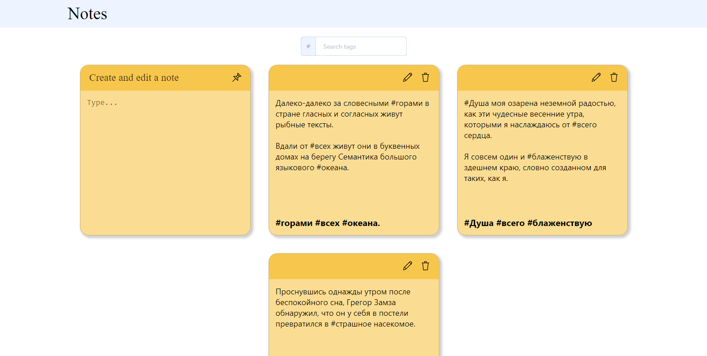
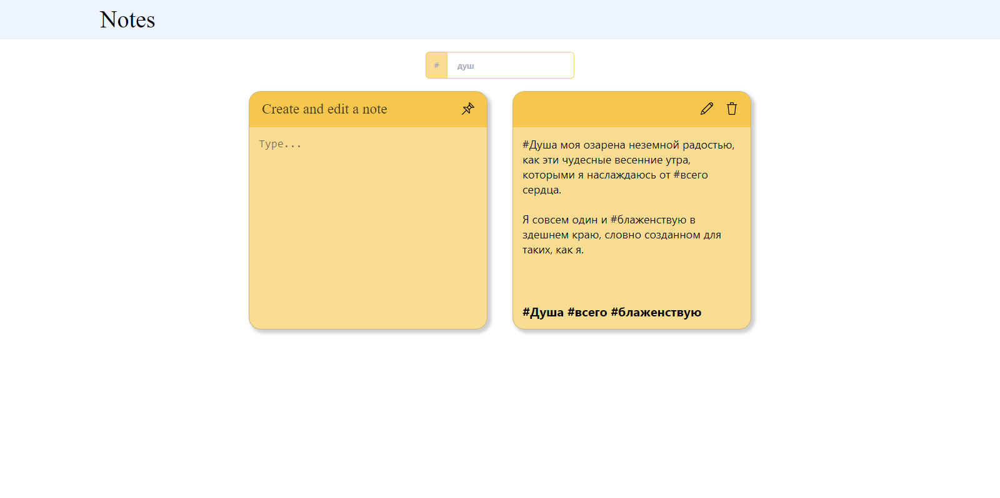

# React Notes App

A one-page application on React: a text editor of notes with tags.

## Screen shot:

### Actions:

- Create, edit, view and delete notes;
- Filter notes by tag;
- Add and remove tags from the list;
- Store data in json format;
- Using CSS preprocessor.

While editing a note, the user can create tags using the # symbol. At the end of the input, the corresponding tag is created and displayed in the list under the text field.The tag filter works using the search bar. 

## Screen shot:

